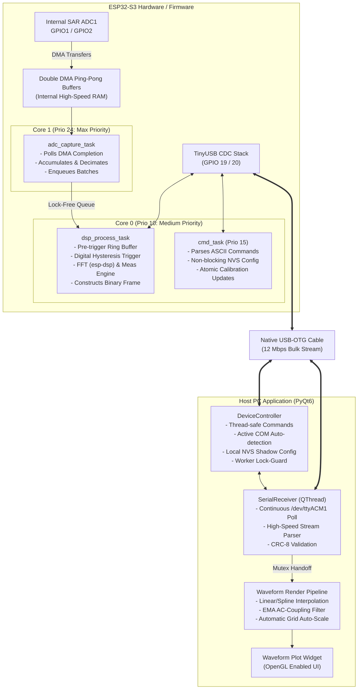

# ESP32-S3 Digital Oscilloscope & Logic Analyzer

[](https://opensource.org/licenses/MIT)
[](https://github.com/espressif/esp-idf)
[](https://www.python.org/)

A high-performance, dual-channel digital oscilloscope system combining an **ESP32-S3** running bare-metal **FreeRTOS** firmware with a beautiful, modern **PyQt6** desktop application. Features high-speed USB CDC streaming (over native USB OTG), real-time FFT spectral analysis, automated measurements, and a fully calibrated Programmable Gain Amplifier (PGA) analog front-end.

---

## ⚡ Technical Highlights

- **Overclocked ADC Sampling**: Reaches up to **~150 kHz** on a single channel (interleaved dual-channel up to ~75 kHz per channel) via low-level hardware registers and DMA clock modifications (`SOC_ADC_SAMPLE_FREQ_THRES_HIGH=160000`, `ADC_LL_CLKM_DIV_NUM_DEFAULT=8`).
- **Ping-Pong Double Buffering**: Lock-free, core-to-core data handoff between Core 1 (DMA ADC Reader) and Core 0 (DSP and USB Processing Tasks) using FreeRTOS Queues as ownership transfers, completely eliminating race conditions.
- **Programmable Gain Amplifier (PGA)**: Fully integrated gain stage using analog switches/GPIO control, incorporating automatic calibration, virtual ground adjustment, input attenuation compensation, and per-step manual trim factors stored in NVS.
- **Crash-Free Dynamic Tuning**: Real-time run-time update of non-linearity correction factors and gain settings without hardware resets or DMA interruption, ensuring uninterrupted acquisition.
- **Precision Digital Triggering**: Edge-based digital trigger engine with real-time hysteresis filtering ($\pm 50\text{ mV}$) to suppress high-frequency noise and pre-trigger buffering for waveform history.

---

## 🏛️ System Architecture



---

## 📌 Hardware Interface & Pinout

### Signal Connections

| Pin / Interface | Direction | Function | Input/Output Levels | Technical Specification |
|:---|:---:|:---|:---:|:---|
| **GPIO1** | Input | ADC Channel 0 (CH1) | $0 - 2.5\text{ V}$ | ADC1_CH0, 12-bit SAR, 12 dB default attenuation |
| **GPIO2** | Input | ADC Channel 1 (CH2) | $0 - 2.5\text{ V}$ | ADC1_CH1, active in Dual Channel mode |
| **GPIO3** | Output | Built-in Test Signal | $0 / 3.3\text{ V}$ | 1 kHz PWM square-wave generator for calibration/self-test |
| **GPIO48** | Output | Status Indicator | $3.3\text{ V}$ | High = USB transmission active |
| **GPIO19** | Native | USB OTG D− | Differential | Directly wired to **"USB"** connector |
| **GPIO20** | Native | USB OTG D+ | Differential | Directly wired to **"USB"** connector |
| **GPIO43** | Serial | UART TX Console | $3.3\text{ V}$ | Wired to USB-to-UART Bridge for flashing/monitoring (**"UART"**) |
| **GPIO44** | Serial | UART RX Console | $3.3\text{ V}$ | Wired to USB-to-UART Bridge for flashing/monitoring (**"UART"**) |

---

## 🛠️ Quick Start Guide

### 1. Requirements & System Setup

*   **ESP-IDF v6.0** toolchain installed.
*   **Python 3.10+** (with `pip` and `venv`).
*   Two USB-C cables (one for the **UART** port and one for the **USB** native port).

### 2. Compile & Flash Firmware

Connect the **UART** port of the DevKit to your PC. Then run:

```bash
# Export the IDF environment variables
source ~/.espressif/v6.0/esp-idf/export.sh

# Build, flash, and open monitor
idf.py build flash monitor -p /dev/ttyACM0
```

> [!NOTE]
> The firmware boots, logs system health on the UART console, and switches the native physical USB port to TinyUSB mode after **2 seconds**. This is normal behavior. The UART monitor will remain active for low-level diagnostic logs.

### 3. Setup and Run the PyQt6 PC Application

Connect a second USB-C cable to the **USB** port of the DevKit.

```bash
# Navigate to the PC Application directory
cd pc_app

# Create a virtual environment
python3 -m venv .venv
source .venv/bin/activate

# Install the premium UI requirements
pip install -r requirements.txt

# Run the software
python3 main.py
```

---

## 📖 Component Breakdown

| Component | Purpose & Features |
|:---|:---|
| [`osc_adc`](components/osc_adc) | Performs continuous DMA SAR ADC scanning, decimates slow-rate sweeps, scales readings dynamically. |
| [`osc_config`](components/osc_config) | Encapsulates thread-safe configuration struct protected by a FreeRTOS Mutex, providing NVS load/save functions. |
| [`osc_dsp`](components/osc_dsp) | Implements fast-windowing real-time FFT (esp-dsp), computes automated parameters (Vpp, Vrms, VAC, Frequency). |
| [`osc_trigger`](components/osc_trigger) | High-speed edge trigger engine operating on raw int16 buffers with custom noise-suppression hysteresis. |
| [`osc_usb`](components/osc_usb) | Low-overhead TinyUSB CDC bulk-endpoint driver utilizing a custom Maxim-Dallas CRC-8 frame structure. |
| [`osc_gen`](components/osc_gen) | LEDC hardware PWM generator enabling arbitrary frequencies and duty-cycles for hardware diagnostic validation. |

---

## 📂 Deep Dive Documentation

For exhaustive technical guides, mathematical formulations, and calibration details, please refer to the following documents:

*   📘 **[Analog Front-End & Calibration Guide](docs/CALIBRATION.md)** — Detailed PGA circuit schematic, impedance models ($R_{on}$ corrections), virtual ground settings, and NVS persistence.
*   📘 **[Hardware Pin Mapping & Inputs](docs/pins.md)** — Voltage limits, input impedance models, DevKit port configurations, and strapping safety.
*   📘 **[NVS & System Configurations](docs/configuration.md)** — Thread-safe structures, clock settings, and default parameters.
*   📘 **[Binary Communication Protocol](docs/protocol.md)** — Framing structures, payload definitions, packet IDs, and the Dallas/Maxim CRC-8 tables.
