# System Configuration & Core Architecture

All device settings, hardware rates, triggers, and calibration limits are managed centrally by the `osc_config` component. The configuration is stored in a thread-safe, NVS-backed global state.

---

## ⚙️ 1. The `osc_config_t` Structure

The core state is represented by the following C structure (defined in `osc_config.h`):

| Struct Field | C Type | Factory Default | Operational Purpose |
|:---|:---|:---:|:---|
| `mode` | `osc_mode_t` | `SINGLE_CH` | Capture mode: `SINGLE_CH` (CH1), `DUAL_CH` (CH1 + CH2 interleaved), or `OVERSAMPLE` |
| `sample_rate_hz` | `uint32_t` | `83333` | Total aggregate ADC hardware sampling rate in Hz |
| `trigger_level_mv` | `float` | `1000.0` | Digital trigger crossing threshold in millivolts |
| `trigger_edge` | `osc_trig_edge_t`| `RISING` | Edge condition: `RISING` (low-to-high), `FALLING`, or `ANY` |
| `trigger_channel` | `uint8_t` | `0` | Channel used for trigger source: `0` (CH1) or `1` (CH2) |
| `ch_atten[2]` | `osc_atten_t[2]` | `12DB, 12DB` | ADC pre-attenuation setting: `0DB`, `2_5DB`, `6DB`, or `12DB` |
| `fft_enabled` | `bool` | `false` | Enables real-time Hanning-windowed FFT computation in the DSP loop |
| `streaming` | `bool` | `false` | Globally enables or disables USB binary data transmission |
| `pre_trigger_samples`| `uint32_t` | `128` | Size of the pre-trigger buffer history (points recorded before trigger) |
| `frame_size` | `uint32_t` | `512` | Active display frame size in samples per channel (must be power of 2) |
| `auto_trigger` | `bool` | `true` | Enables auto-trigger sweep if no edge is hit during the timeout |
| `auto_trigger_timeout_ms` | `uint32_t` | `200` | Timeout period in milliseconds for the auto-trigger fallback |
| `measurements_enabled`| `bool` | `true` | Enables automated wave parameter calculation (Vpp, Vrms, Frequency, etc.) |
| `oversample_factor` | `uint8_t` | `16` | Dynamic decimation factor (effective only when mode is `OVERSAMPLE`) |
| `adc_correction_factor` | `float` | `1.037` | Global linear scaling factor to compensate for upper attenuator errors |
| `pga_enabled` | `bool` | `false` | Enables active PGA control stage and disables manual attenuation steps |
| `pga_step` | `uint8_t` | `0` | Active PGA gain step selector ($0 - 7$ range) |

---

## 🧵 2. FreeRTOS Task & Core Architecture

To guarantee zero sample drops and stable USB communications, the firmware partitions execution across the ESP32-S3's dual cores:

```mermaid
gantt
    title Task Scheduling & Core Assignments
    dateFormat  X
    axisFormat %s
    
    section Core 1 (Application)
    adc_capture_task (Prio 24 - DMA Reader) : active, 0, 10
    
    section Core 0 (Protocol & DSP)
    cmd_task (Prio 15 - USB Commands)      : after capture, 5
    dsp_process_task (Prio 10 - FFT/Meas)  : after command, 8
    TinyUSB Internal Task (Prio 20)       : crit, 0, 10
```



### Core Allocation Details

1. **`adc_capture_task` (Core 1, Priority 24 - Pinned)**:
   - **Critical Role**: High-speed DMA buffer ingestion. Runs at maximum priority to guarantee the DMA ring buffer is read before overflows occur.
   - **Decimation**: Performs real-time sample averaging when scaling down sweeps, improving signal-to-noise ratio.
2. **`dsp_process_task` (Core 0, Priority 10 - Pinned)**:
   - **Critical Role**: Runs edge-detection triggers, computes windowed FFTs using `esp-dsp` optimized libraries, processes wave analytics, and builds binary structures.
3. **`cmd_task` (Core 0, Priority 15 - Pinned)**:
   - **Critical Role**: Polls the command queue fed by the USB CDC input callback, writes thread-safe updates to the global config, and commits parameters to NVS safely.
4. **`TinyUSB Internal Task` (Core 0, Priority 20)**:
   - **Critical Role**: Ingests serial data at USB physical layer speeds, ensuring bulk streaming frames are flushed to the host computer.

---

## 🚀 3. ADC Overclocking & Kconfig Configuration

The standard ESP32-S3 ADC clock configuration limits sampling to ~83 kHz. To break this ceiling and achieve stable **150 kHz** conversion rates, the firmware applies compiler overrides to inject low-level hardware constants.

### Compilation Flag Injection (`CMakeLists.txt`)
```cmake
# High-speed register overrides
add_compile_options("-DSOC_ADC_SAMPLE_FREQ_THRES_HIGH=160000")
add_compile_options("-DADC_LL_CLKM_DIV_NUM_DEFAULT=8")
```

### Required sdkconfig Configuration Rules
To maintain clock phase stability and avoid hardware timing jitter, **Power Management (DFS/DFS-Light) must be entirely disabled**.

```kconfig
# Power Management Constraints
CONFIG_PM_ENABLE=n

# Internal Memory Buffer Priority
CONFIG_SPIRAM_USE_MALLOC=y
CONFIG_SPIRAM_MALLOC_ALWAYSINTERNAL=16384  # Guarantees DMA structures stay in internal SRAM
```
